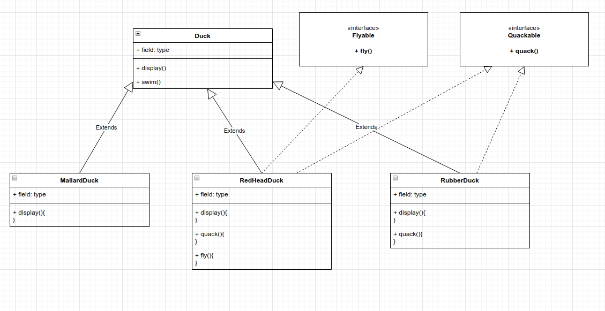
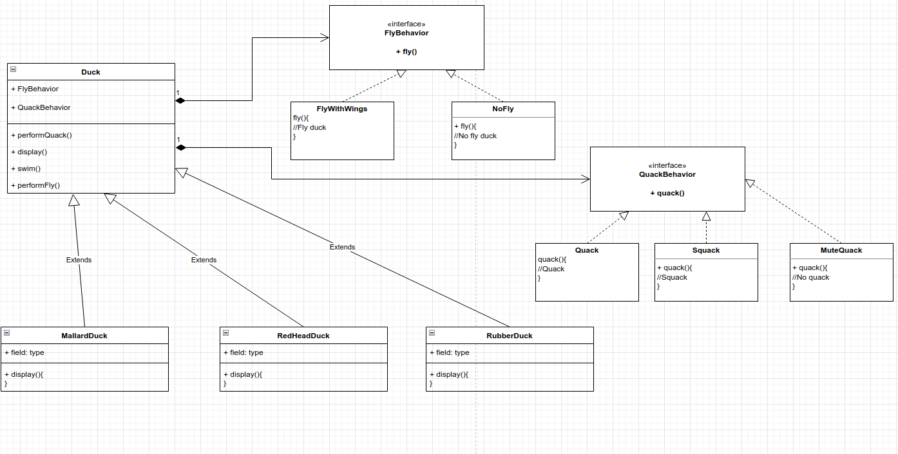

# Strategy Pattern
Defines a family of algorithms, encapsulate each one, and makes them interchangeable. Strategy lets the algorithm vary
independently from clients that use it.

Favor composition over inheritance.

With inheritance, you make code duplications, add behavior to classes that doesn't need, more difficult to maintain.

BEFORE



AFTER



Change behavior at runtime

```
public class DuckSimulator
{
    public static void main( String[] args )
    {
        Duck model = new ModelDuck();
        model.performFly();
        model.performQuack();
        model.setFlyBehavior(new FlyRocketPowerd());
        model.performFly();
    }
}

OUTPUT
I can't fly
Quack!
I'm a flying with a rocket

```