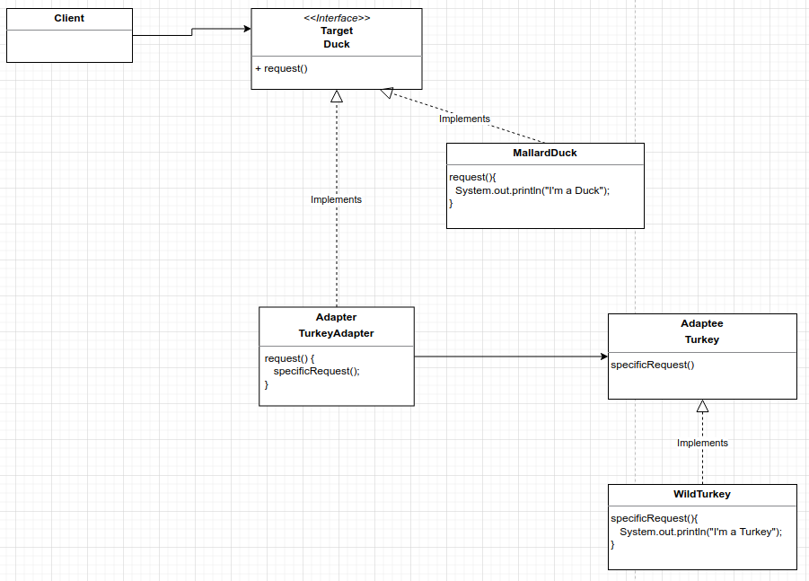
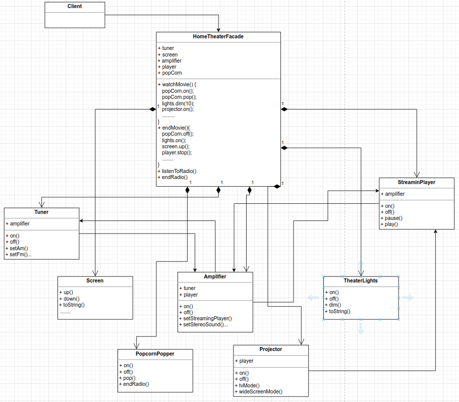

# Adapter Pattern
The adapter pattern converts the interface of a class into another interface the clients expect. Adapter lets classes work together that couldn't otherwise
because of incompatible interface.

Object Adapter use Compositon
Class Adapter use Inheritance - Not permited in Java because use double extends

Convert a Turkey into a Duck - Wrap the object that has an incompatible interface with an object that implements the correct one.




```
public static void main(String[] args) {
    Duck duck = new MallardDuck();
    Turkey turkey = new WildTurkey();

    Duck turkeyAdapter = new TurkeyAdapter(turkey);
    System.out.println("The Turkey says...");
    turkey.gobble();
    turkey.fly();

    System.out.println("The Duck says...");
    testDuck(duck);
    System.out.println("The Turkey adapter says...");
    testDuck(turkeyAdapter);
}

static void testDuck(Duck duck){
    duck.quack();
    duck.fly();
}

OUTPUT
The Turkey says...
Gobble gobble
I'm flying a short distance
The Duck says...
Quack
I'm flying
The Turkey adapter says...
Gobble gobble
//Turkey needs 5 times to fly
I'm flying a short distance
I'm flying a short distance
I'm flying a short distance
I'm flying a short distance
I'm flying a short distance

```

Object adapters use composition whilst class adapters use inheritance, this makes the class adapters les adaptive
since you can't mix the behavior. With composition you can call any subclass of interface.

# Faced Pattern
It provides a simplified interface to a subsystem while still exposing the full functionality of the system to those who may need it. Facade
defines a higher-level interface that makes the subsystem easier to use.

Decoupled Client from Subsystems.



Design Principle: Principle of Least Knowledge: talk only to your immediate friends. Close friends.

Decorator: Doesn't alter the interface, but adds responsibility

Adapter: Converts one interface to another

Facade: Makes an interface simpler.
