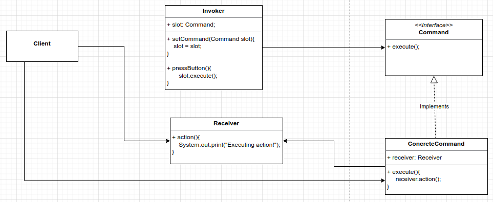

# Command Pattern
Encapsulate a request as an object, thereby letting you parameterize other objects with different requests, queue, log and undoable operations.

Encapsulate methods into Command objects: store them, pass them around, and invoke them.

Commands may support undo by implementing a undo() method that restores the object to its previous state before the execute() method was last called.

MacroCommands are a simple extension of the Command Pattern that allow multiple commands to be invoked. Likewise, MacroCommands can easily support undo().

Command Pattern:




```
public static void main( String[] args )
{
    //The invoker
    SimpleRemoteControl remote = new SimpleRemoteControl();
    //The receiver
    Light light = new Light("Living Room");
    GarageDoor garageDoor = new GarageDoor("Garage Door");
    //The concrete command
    LightOnCommand lightOn = new LightOnCommand(light);
    GarageDoorOpenCommand garageOpen = new GarageDoorOpenCommand(garageDoor);

    remote.setCommand(lightOn);
    remote.buttonWasPressed();

    remote.setCommand(garageOpen);
    remote.buttonWasPressed();
}

OUTPUT
Living Room turn the light on
Garage Door is Open!

```

The command pattern decouples by a common interface called Command and its implementation. 
The invoker hold the command and invoke the execute method. The CommandImplementation hold the Receiver, implements the execute and 
call the action of Receiver.

SwingObserverExample = Client
JButton = Invoker
System.out.println inside the actionPerformed() = Receiver
ActionListener = Command
AngelListener e DevilListener = Concrete Command