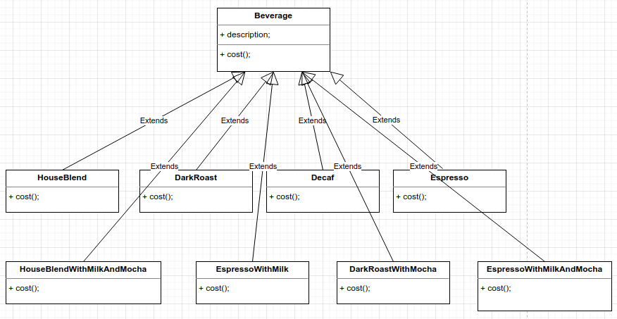
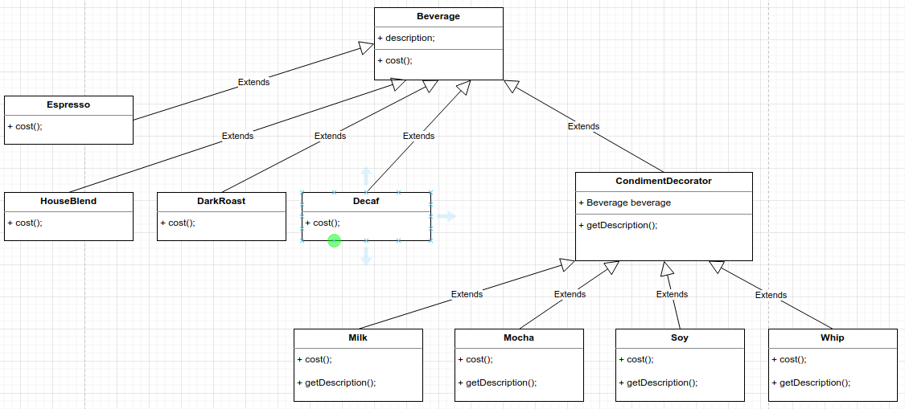

# Decorator Pattern
Attaches additional responsibilities to an object dynamically. Decorators provide a flexible alternative to subclassing for extending functionality.

Design Principle: Classes should be open for extension, but closed for modification.

Decorators have the same supertype as the objects they decorate. Decorator adds its own behavior before and/or after delegating to the object it 
decorates to do the rest of the job. 

For each new composition we add a new extension. Make impossible to compose behaviors. Class bomb.

BEFORE



Our goal is to allow classes to be easily extended to incorporate new behavior without modifying existing code.

AFTER




```
public class Starbuzz
{
    public static void main( String[] args )
    {
        Beverage espresso = new Espresso();
        System.out.println(espresso.getDescription() + " Cost:" + espresso.cost());

        Beverage darkRoast = new Whip(new Mocha(new Mocha(new DarkRoast())));
        System.out.println(darkRoast.getDescription() + " Cost:" + darkRoast.cost());

        Beverage houseBlend = new HouseBlend();
        houseBlend.setSize(Beverage.Size.GRANDE);
        houseBlend = new Soy(houseBlend);
        houseBlend = new Mocha(houseBlend);
        houseBlend = new Whip(houseBlend);
        System.out.println(houseBlend.getDescription()
                + " $" + String.format("%.2f", houseBlend.cost()));
    }
}

OUTPUT
Espresso Cost:1.99
Adding Whip + Adding Mocha + Adding Mocha + Most Exellent Dard Roast Cost:1.49
Adding Whip + Adding Mocha + Adding Soy + Most Exellent House Blend $1.34
```