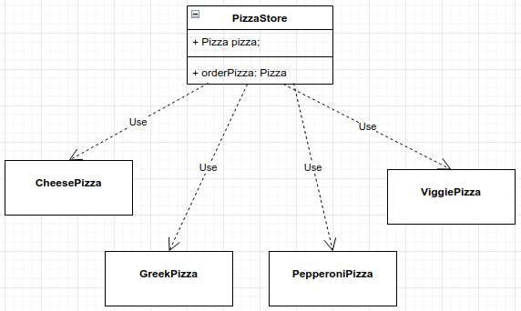
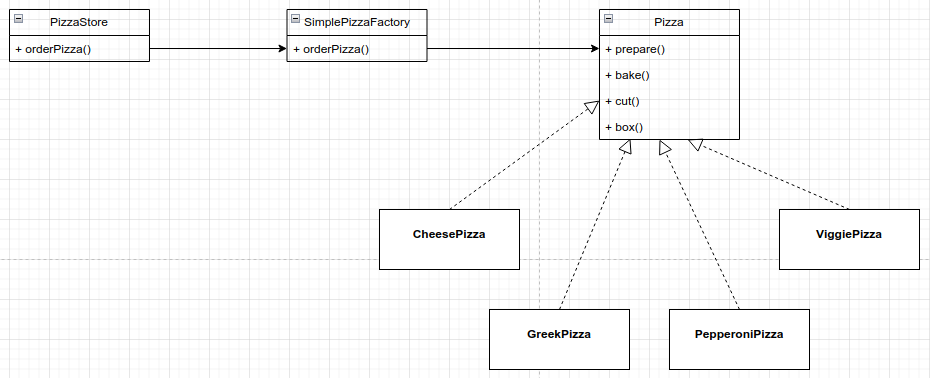
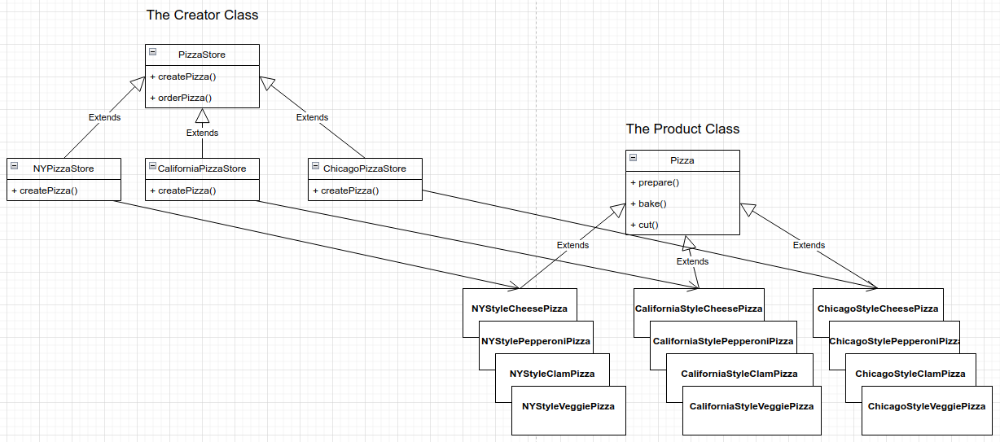

# Factory Pattern 
Encapsulate the code that create objects. By placing creation code in one object or method, avoid duplication and provide one place to perform
maintenance.

Design Principle: Dependency Inversion Principle. Depend upon abstraction. Do not depend upon concrete classes.

Identify the aspects that vary and separate them from what stays the same. For each new Pizza you need to change the code and add
an if or remove one existent, dealing with concrete class is instantiated is really messing up order pizza.

BEFORE



```
public Pizza orderPizza(String type){
        Pizza pizza;

        if(type.equals("cheese")){
            pizza = new CheesePizza();
        } else if (type.equals("greek")){
            pizza = new GreekPizza();
        } else if (type.equals("pepperoni")){
            pizza = new PepperoniPizza();
        } else {
            pizza = new DefaultPizza();
        }
        pizza.prepare();
        pizza.bake();
        pizza.cut();
        pizza.box();

        return pizza;
    }
```

What we're going to do is take the creation code and move it out into another object that is only going to be concerned with creating pizza.

AFTER



Once we have a SimplePizzaFactory, our orderPizza() method becomes a client of that object. Anytime it needs a pizza, it asks the pizza factory to make one.

```
public class PizzaStore {

     SimplePizzaFactory factory;

    public PizzaStore(SimplePizzaFactory factory) {
        this.factory = factory;
    }
    
    public Pizza orderPizza(String type){
        Pizza pizza;

        pizza = factory.createPizza(type);

        pizza.prepare();
        pizza.bake();
        pizza.cut();
        pizza.box();
        return pizza;
    }
}

public class SimplePizzaFactory {

    public Pizza createPizza(String type){
        Pizza pizza = null;

        if(type.equals("cheese")){
            pizza = new CheesePizza();
        } else if(type.equals("pepperoni")){
            pizza = new PepperoniPizza();
        } else if(type.equals("clam")){
            pizza = new GreekPizza();
        } else if(type.equals("veggie")){
            pizza = new VeggiePizza();
        }

        return pizza;
    }
}
```
AFTER

A factory method handles object creation and encapsulates it in a subclass. The Factory Method Pattern defines an interface for creating
an object, but lets subclass decide which class to instantiate. Factory Method lets a class defer instantiation to subclasses.



```
public class PizzaTestDrive 
{
    public static void main( String[] args )
    {
        PizzaStore nyStore = new NYPizzaStore();
        PizzaStore chicagoStore = new ChicagoPizzaStore();

        Pizza pizza = nyStore.orderPizza("cheese");
        System.out.println("Ethan ordered a " + pizza.getName() + "\n");

        pizza = chicagoStore.orderPizza("cheese");
        System.out.println("Joel ordered a " + pizza.getName() + "\n");
    }
}

Preparing NY Style Sauce and Cheese Pizza
Tossing dough...
Adding sauce...
Adding toppings: 
 Graed Reggiano Cheese
Bake for 25 minutes at 350
Cutting the pizza into diagonal slices
Place pizza in official PizzaStore box
Ethan ordered a NY Style Sauce and Cheese Pizza

Preparing Chicago Style Deep Dish Cheese Pizza
Tossing dough...
Adding sauce...
Adding toppings: 
 Shredded Mozzarella Cheese
Bake for 25 minutes at 350
Cutting the pizza into square slices
Place pizza in official PizzaStore box
Joel ordered a Chicago Style Deep Dish Cheese Pizza
```