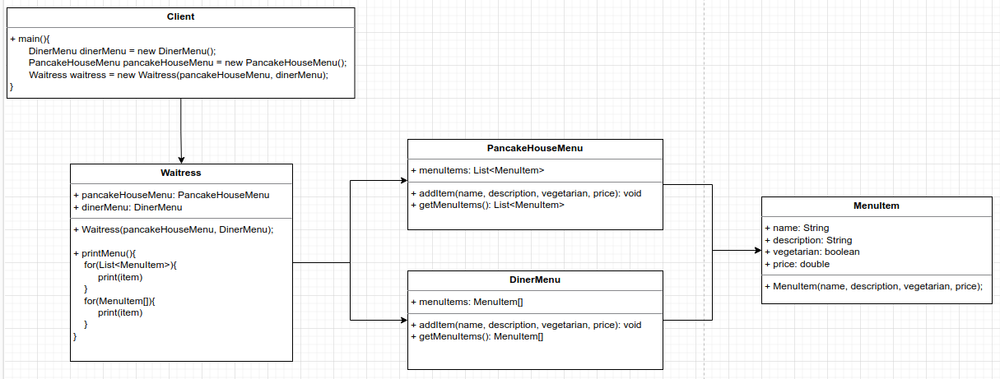
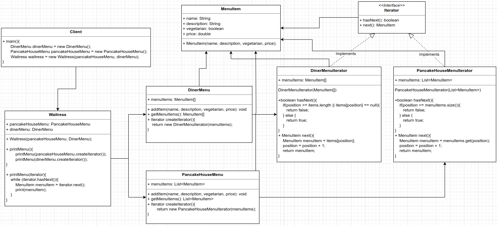
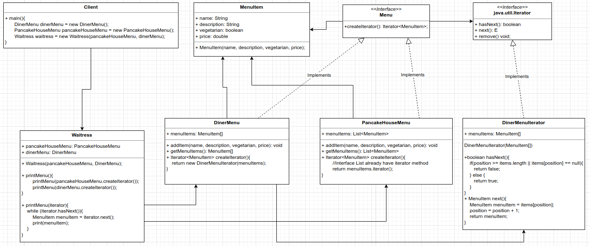

# Iterator Pattern
Provide a way to access the elements of an aggregate object sequentially without exposing its underlying representation.

Design Principle: A class should have only one reason to change. More than one responsibility means more than one area of change.

If you don't have a single interface to aggregate you need to implement two fors to iterate to two different data structures: ArrayList and Array

BEFORE



Create a method that implements the same interface Iterator, and iterator from it method to print the elements.

AFTER



If you want, you can also simplify by using the Iterator interface from Java language, since List interface already have a method that give an Iterator, you don't need
the PancakeHouseMenuIterator class:




```
public Waitress(Menu pancakeHouseMenu, Menu dinerMenu) {
    this.pancakeHouseMenu = pancakeHouseMenu;
    this.dinerMenu = dinerMenu;
}

public void printMenu(){
    Iterator<MenuItem> pancakeHouseMenuIterator = pancakeHouseMenu.createIterator();
    Iterator<MenuItem> dinerMenuIterator = dinerMenu.createIterator();
    System.out.println("MENU\n-----\nBREAKFAST");
    printMenu(pancakeHouseMenuIterator);
    System.out.println("\nLUNCH");
    printMenu(dinerMenuIterator);
}

private void printMenu(Iterator<MenuItem> iterator){
    while (iterator.hasNext()){
        MenuItem menuItem = iterator.next();
        System.out.println("Name:" + menuItem.getName() + " - Description: " + menuItem.getDescription() + " - Price: " + menuItem.getPrice());
    }
}

OUTPUT
MENU
-----
BREAKFAST
Name:K&B's Pancake Breakfast - Description: Pancakes with scrambled eggs and toast - Price: 2.99
Name:Regular Pancake Breakfast - Description: Pancakes with fried eggs, sausage - Price: 2.99
Name:Blueberry Pancakes - Description: Pancakes made with fresh blueberries - Price: 3.49
Name:Waffles - Description: Waffles with your choice of blueberries or strawberries - Price: 3.59

LUNCH
Name:Vegetarian BLT - Description: (Fakin') Bacon with lettuce & tomato on whole wheat - Price: 2.99
Name:BLT - Description: Bacon with lettuce & tomato on whole wheat - Price: 2.99
Name:Soup of the day - Description: Soup of the day, with a side of potato salad - Price: 3.29
Name:Hotdog - Description: A hot dog, with sauerkraut, relish, onions, topped with cheese - Price: 3.05
Name:Steamed Veggies and Brown Rice - Description: Steamed vegetables over brown rice - Price: 3.99
Name:Pasta - Description: Spaghetti with Marinara Sauce, and a slice of sourdough bread - Price: 3.89

```