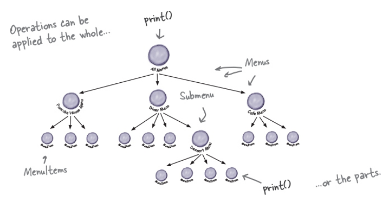
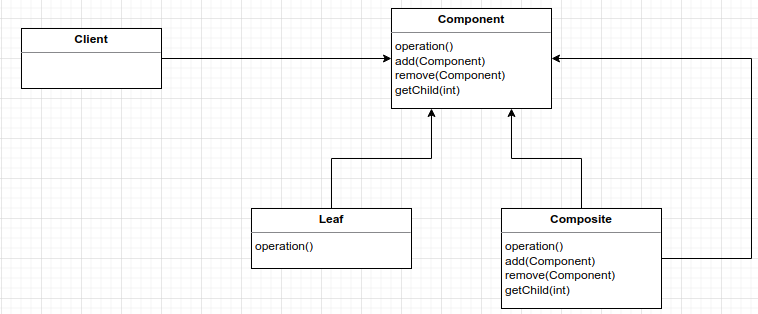
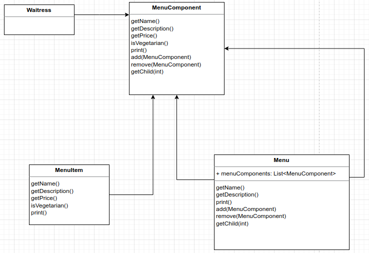
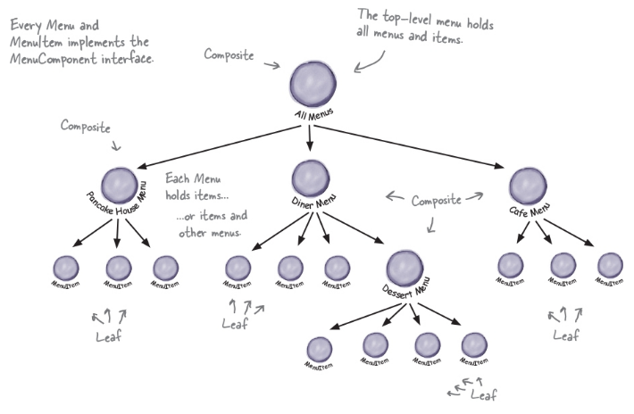

# Iterator Pattern
Provides a way to access the elements of an aggregate object sequentially without exposing its underlying representation.

This makes a lot of sense: the pattern gives you a way to stp through the elements of an aggregate without having to know how things are
represented under the covers

Design Principle: A class should have only one reason to change. More than one responsibility means more than one area of change.

**Cohesion** is a term you'll hear used as a measure of how closely a class or a module supports a single purpose or responsibility.  
High Cohesion = designed around related functions  
Low Cohesion = designed around unrelated functions  

If you don't have a single interface to aggregate you need to implement two fors to iterate to two different data structures: ArrayList and Array

BEFORE


Create a method that implements the same interface Iterator, and iterator from it method to print the elements.

AFTER


If you want, you can also simplify by using the Iterator interface from Java language, since List interface already have a method that give an Iterator, you don't need
the PancakeHouseMenuIterator class:


```
public Waitress(Menu pancakeHouseMenu, Menu dinerMenu) {
    this.pancakeHouseMenu = pancakeHouseMenu;
    this.dinerMenu = dinerMenu;
}

public void printMenu(){
    Iterator<MenuItem> pancakeHouseMenuIterator = pancakeHouseMenu.createIterator();
    Iterator<MenuItem> dinerMenuIterator = dinerMenu.createIterator();
    System.out.println("MENU\n-----\nBREAKFAST");
    printMenu(pancakeHouseMenuIterator);
    System.out.println("\nLUNCH");
    printMenu(dinerMenuIterator);
}

private void printMenu(Iterator<MenuItem> iterator){
    while (iterator.hasNext()){
        MenuItem menuItem = iterator.next();
        System.out.println("Name:" + menuItem.getName() + " - Description: " + menuItem.getDescription() + " - Price: " + menuItem.getPrice());
    }
}

OUTPUT
MENU
-----
BREAKFAST
Name:K&B's Pancake Breakfast - Description: Pancakes with scrambled eggs and toast - Price: 2.99
Name:Regular Pancake Breakfast - Description: Pancakes with fried eggs, sausage - Price: 2.99
Name:Blueberry Pancakes - Description: Pancakes made with fresh blueberries - Price: 3.49
Name:Waffles - Description: Waffles with your choice of blueberries or strawberries - Price: 3.59

LUNCH
Name:Vegetarian BLT - Description: (Fakin') Bacon with lettuce & tomato on whole wheat - Price: 2.99
Name:BLT - Description: Bacon with lettuce & tomato on whole wheat - Price: 2.99
Name:Soup of the day - Description: Soup of the day, with a side of potato salad - Price: 3.29
Name:Hotdog - Description: A hot dog, with sauerkraut, relish, onions, topped with cheese - Price: 3.05
Name:Steamed Veggies and Brown Rice - Description: Steamed vegetables over brown rice - Price: 3.99
Name:Pasta - Description: Spaghetti with Marinara Sauce, and a slice of sourdough bread - Price: 3.89

```

What if you have submenus, or menus inside menus for case of dessert.



# Composite Pattern
Allows you to compose objects into tree structures to represent part-whole hierarchies. Composite lets clients treat individual objects and compositions
of objects uniformly.

A composite contains components. Components can be composites or leaf. A composite holds a set of children; those children may be other composites
or leaf elements



Design Menus:



The tree structure it will be:




1-) Implements Menu interface to have the method createIterator();

2-) Implements the createIterator to transform a Map into a Iterator

3-) Instantiate CafeMenu into Waitress and pass the cafeMenu to printMenu method();