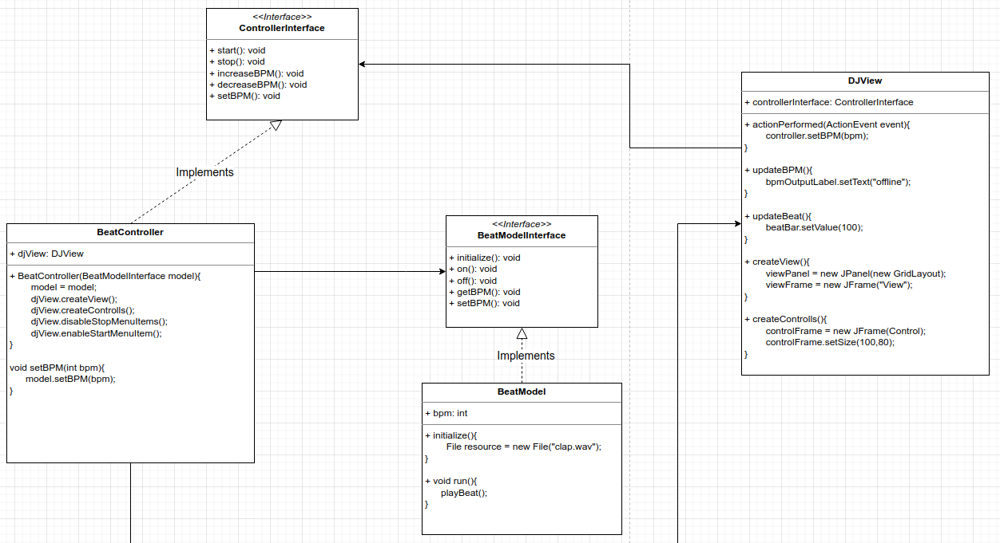

# MVC Pattern
The Model View Controller(MVC) Pattern is a compound pattern consisting of the Observer, Strategy, and Composite Pattern.

# Observer
The model make use of the Observer Pattern so that it can keep observers updated yet stay decoupled from them.

# Strategy
The controller is the Strategy for the view. The view can use different implementations of the controller to get different behavior.

# Composite
The view uses the composite pattern to implement the user interface, which usually consists of nested components like panels, frames, and buttons.

# Adapter
Use an adapter to adapt a model to work with existing controller and views.