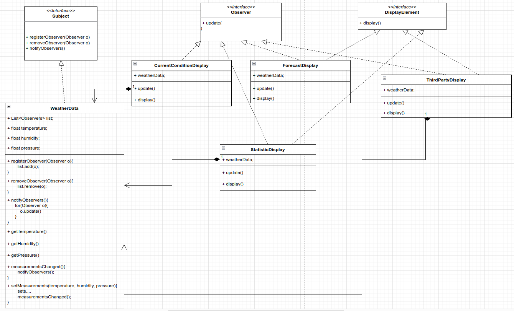

# Observer Pattern
Defines a one-to-many dependency between objects so that when one object changes state, all of its dependents are notified and updated automatically.

Design Principle: Strive for loosely coupled designs between objects that interact.

We code to concrete implementation, not interfaces. For every new display we'll need to alter the code. We have no way to add(or remove) display
element at runtime.  We haven't encapsulated the parts that changes.

BEFORE


When the state of one object changes, all of its dependents are notified. We have one subject, who notifies many observers when something in
the subject changes.

AFTER



Subjects update Observers using common interface
Observer are loosely coupled in that Subject
You can pull or push data from the Subject - pull is considered more "correct"

```
public class WeatherStation
{
    public static void main( String[] args )
    {
        WeatherData weatherData = new WeatherData();
        CurrentConditionDisplay currentConditionDisplay = new CurrentConditionDisplay(weatherData);
        StatisticsDisplay statisticsDisplay = new StatisticsDisplay(weatherData);
        ForecastDisplay forecastDisplay = new ForecastDisplay(weatherData);
        HeatIndexDisplay heatIndexDisplay = new HeatIndexDisplay(weatherData);

        weatherData.setMeasurements(80,65,30.4f);
        weatherData.setMeasurements(82,70,29.2f);
        weatherData.setMeasurements(78,90,29.2f);
    }
}

OUTPUT
Current conditions: 80.0F degrees and 65.0% humidity
Avg/Max/Min temperature = 80.0/80.0/80.0
Forecast: Improving weather on the way!
Heat index is 82.95535
Current conditions: 82.0F degrees and 70.0% humidity
Avg/Max/Min temperature = 81.0/82.0/80.0
Forecast: Watch out for cooler, rainy weather
Heat index is 86.90124

```