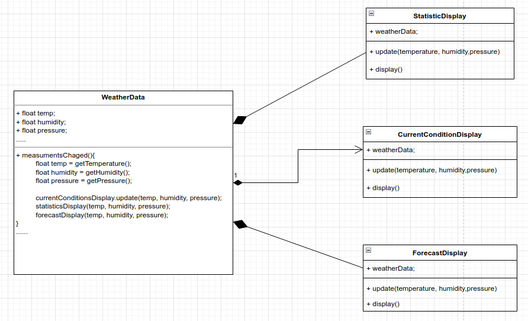

# Observer Pattern
Defines a one-to-many dependency between objects so that when one object changes state, all of its dependents are notified and updated automatically.

Design Principle: Strive for loosely coupled designs between objects that interact.

We code to concrete implementation, not interfaces. For every new display we'll need to alter the code. We have no way to add(or remove) display
element at runtime.  We haven't encapsulated the parts that changes. WeatherData class violate encapsulation.

BEFORE



When the state of one object changes, all of its dependents are notified. We have one subject, who notifies many observers when something in
the subject changes.

AFTER


Change behavior at runtime

```
public class DuckSimulator
{
    public static void main( String[] args )
    {
        Duck mallard = new MallardDuck();
        mallard.performQuack();
        mallard.performFly();
    
        Duck model = new ModelDuck();
        model.performFly();
        model.performQuack();
        model.setFlyBehavior(new FlyRocketPowerd());
        model.performFly();
    }
}

OUTPUT
//MallardDuck
Quack!
I'm flying with wings

//ModelDuck
I can't fly
Quack!
I'm a flying with a rocket

```