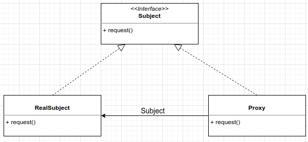

# Proxy Pattern
The proxy pattern provides a representative for another object in order to control the client's access to it. There are 
a number of ways it can manage that access.  

Call methods remotely and treat than as locally.
RMI = Remote Method Invocation

Proxy as a representative to another object.

Subject = Provides the interface to the RealSubject and the Proxy.  
The RealSubject = is the object that does the real work.  
The Proxy = holds a reference to the real object.

To execute the MyRemote example you first need to run:  
rmiregistry
javac *.java
java MyRemoteImpl  
And then execute MyRemoteClient.

## Remote Proxy
With remote proxy, the proxy acts as a local representative for an object that lives in a different JVM.

## Virtual Proxy
The virtual proxy acts as a representative for an object that may be expensive to create. The proxy could show
an image whilst is loading all the object under the cover.

## Protection Proxy
It's a proxy that control access to an object based on access rights. 

Decorator - The decorator patter adds behavior to an object, while Proxy controls access.