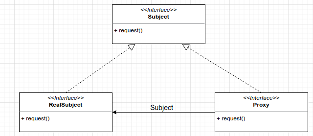

# Proxy Pattern
Call methods remotely and treat than as locally. A remote proxy acts as a local representative to a remote object.  
RMI = Remote Method Invocation

Proxy as a representative to another object.

