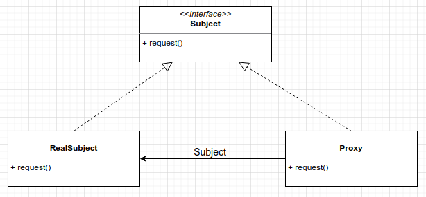
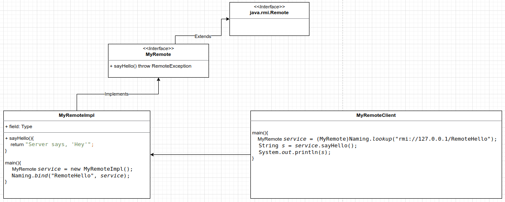
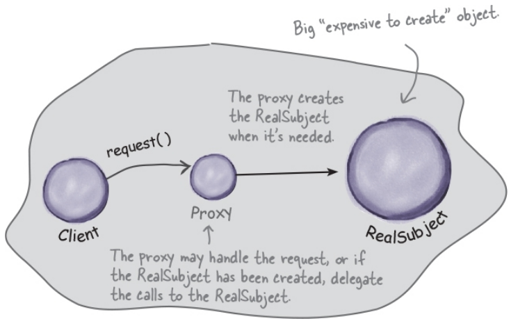
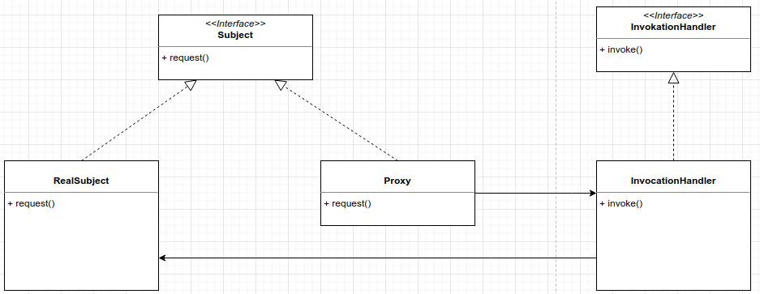

# Proxy Pattern
The proxy pattern provides a representative for another object in order to control the client's access to it. There are 
a number of ways it can manage that access.  

Call methods remotely and treat than as locally.
RMI = Remote Method Invocation

Proxy as a representative to another object.

Subject = Provides the interface to the RealSubject and the Proxy.  
The RealSubject = is the object that does the real work.  
The Proxy = holds a reference to the real object.  



## Remote Proxy
With remote proxy, the proxy acts as a local representative for an object that lives in a different JVM.  

  

To execute the MyRemote example you first need to run:    
rmiregistry  
javac *.java  
java MyRemoteImpl    
And then execute MyRemoteClient.

```
public interface MyRemote extends Remote {
    public String sayHello() throws RemoteException;
}

public class MyRemoteImpl extends UnicastRemoteObject implements MyRemote {

    private static final long serialVersionUID = 1L;

    public MyRemoteImpl() throws RemoteException {
    }

    public static void main(String[] args) {
        try {
            MyRemote service = new MyRemoteImpl();
            Naming.bind("RemoteHello", service);
        } catch (RemoteException | AlreadyBoundException | MalformedURLException e) {
            throw new RuntimeException(e);
        }
    }

    @Override
    public String sayHello() throws RemoteException {
        return "Server says, 'Hey'";
    }
}

public class MyRemoteClient {

    public static void main(String[] args) {
        new MyRemoteClient().go();
    }

    private void go() {
        try {
            MyRemote service = (MyRemote) Naming.lookup("rmi://127.0.0.1/RemoteHello");
            String s = service.sayHello();
            System.out.println(s);
        } catch (NotBoundException e) {
            throw new RuntimeException(e);
        } catch (MalformedURLException e) {
            throw new RuntimeException(e);
        } catch (RemoteException e) {
            throw new RuntimeException(e);
        }
    }
}
```

## Virtual Proxy
The virtual proxy acts as a representative for an object that may be expensive to create. The proxy could show
an image whilst is loading all the object under the cover.
```
public ImageProxy(URL url) {
    imageURL = url;
    imageLoaded = new ImageLoaded(this);
    imageNotLoaded = new ImageNotLoaded(this);
    imageState = imageNotLoaded;
}

public void setImageState(ImageState imageState) {
    this.imageState = imageState;
}

ImageNotLoaded.java
public void setImageIcon(ImageIcon imageIcon) {
    imageProxy.setImageState(imageProxy.getImageLoaded());
    imageProxy.setImageIcon(imageIcon);
}
```




## Protection Proxy
It's a proxy that control access to an object based on access rights.  
```
@Override
public Object invoke(Object proxy, Method method, Object[] args) throws Throwable {
    try {
        if (method.getName().startsWith("get")) {
            return method.invoke(person, args);
        } else if (method.getName().startsWith("setGeekRating")) {
            throw new IllegalAccessException();
        } else if (method.getName().startsWith("set")) {
            return method.invoke(person, args);
        }
    }catch (InvocationTargetException e){
        e.printStackTrace();
    }
    return null;
}
```




Decorator - The decorator patter adds behavior to an object, while Proxy controls access.