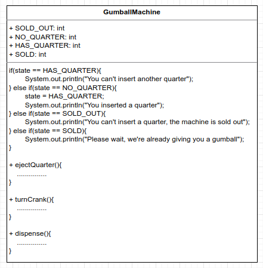

# State Pattern
Allows an object to alter its behavior when its internal state changes. The object will appear to change its class.

Favor composition over inheritance.

All the states in one class and if you need to change or add a new state, you need to change this class

BEFORE



Take the parts that vary and encapsulate them, so that later you can alter or extend the parts that vary without affecting those that don't.
Encapsulate state objects in their own classes and then delegate to the current state when an action occurs.

AFTER


Change behavior at runtime

```
public class DuckSimulator
{
    public static void main( String[] args )
    {
        Duck mallard = new MallardDuck();
        mallard.performQuack();
        mallard.performFly();
    
        Duck model = new ModelDuck();
        model.performFly();
        model.performQuack();
        model.setFlyBehavior(new FlyRocketPowerd());
        model.performFly();
    }
}

OUTPUT
//MallardDuck
Quack!
I'm flying with wings

//ModelDuck
I can't fly
Quack!
I'm a flying with a rocket

```

Choose all that apply
A,C,D,E,F