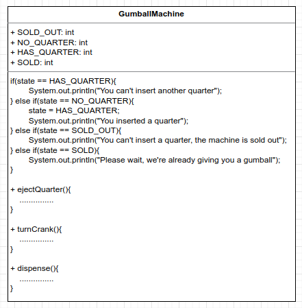
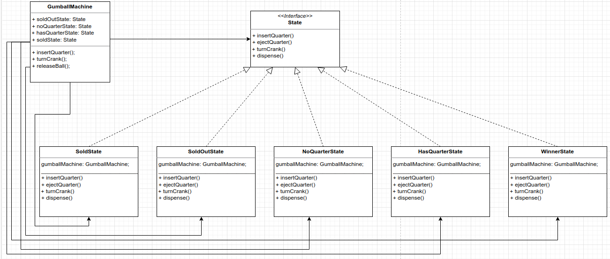

# State Pattern
Allows an object to alter its behavior when its internal state changes. The object will appear to change its class.

Favor composition over inheritance.

Difference between Strategy and State  
Strategy: Allow object to incorporate different behavior or algorithms through composition and delegation.   
Subclasses decide how to implement steps in an algorithm

State: Create context objects, change their state overtime according to well-defined state transitions. Change behavior is built in to schema.  
Encapsulate interchangeable behaviors and use delegation to decide which behavior to use.

All the states in one class and if you need to change or add a new state, you need to change this class

BEFORE



Take the parts that vary and encapsulate them, so that later you can alter or extend the parts that vary without affecting those that don't.
Encapsulate state objects in their own classes and then delegate to the current state when an action occurs.

AFTER



Change behavior at runtime

```
public GumballMachine(int numberGumballs) {
    soldState = new SoldState(this);
    noQuarterState = new NoQuarterState(this);
    hasQuarterState = new HasQuarterState(this);
    soldOutState = new SoldOutState(this);
    winnerState = new WinnerState(this);

    this.count = numberGumballs;
    if(numberGumballs > 0){
        state = noQuarterState;
    } else {
        state = soldOutState;
    }
}

public void insertQuarter(){
    state.insertQuarter();
}

public void turnCrank(){
        state.turnCrank();
        state.dispense();
}

void releaseBall(){
    System.out.println("A gumball comes rolling out the slot...");
    if(count > 0){
        count = count - 1;
    }
}

OUTPUT
Mighty Gumball, Inc.
Java-enabled Standing Gumball Model #2004
Inventory: 5 gumballs
Machine is waiting for quarter

You inserted a quarter
You turned...
A gumball comes rolling out the slot...
A gumball comes rolling out the slot...
YOU'RE A WINNER! You got two gumballs for your quarter

Mighty Gumball, Inc.
Java-enabled Standing Gumball Model #2004
Inventory: 3 gumballs
Machine is waiting for quarter

You inserted a quarter
You turned...
A gumball comes rolling out the slot...
A gumball comes rolling out the slot...
YOU'RE A WINNER! You got two gumballs for your quarter
You inserted a quarter
You turned...
A gumball comes rolling out the slot...
Oops, out of gumballs

Mighty Gumball, Inc.
Java-enabled Standing Gumball Model #2004
Inventory: 0 gumballs
Machine is sold out
```

Choose all that apply
A,C,D,E,F