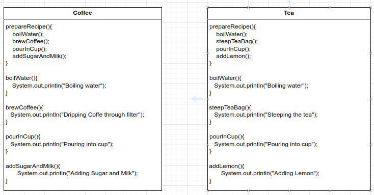
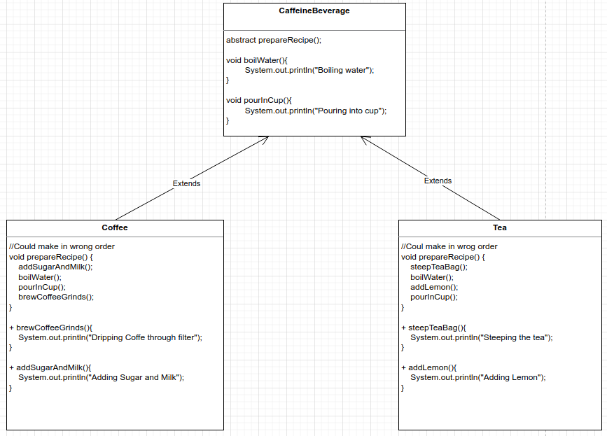
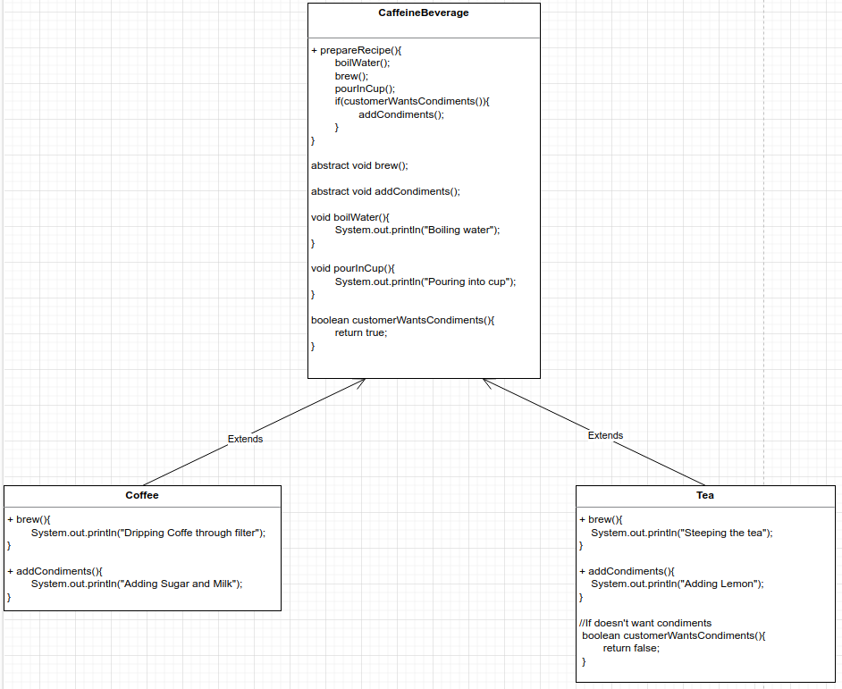

# Template Pattern
Define the skeleton of an algorithm in an operation, deferring some steps to subclasses. Template Method lets subclasses redefine
certain steps of an algorithm without changing the algorithm's structure.

Design Principle: The Hollywood Principle - Don't call us, we'll call you - Classes of high-level cannot depend on class of low-level

Hooks: Are methods that do nothing or default behavior in the abstract class, but may be overridden in the subclass.

If you want the subclass to change algorithm in the template method, you can declare the template method as final.

A Starbucks Coffee



1-) First approach: See what is common between the classes and put on an abstract class to eliminate code duplication. 
Problem: Some people can make the beverage on the wrong order and some code is still very similar.



2-) Template Method: Put the code that is common between the classes and also define the order that is called to not make
the beverage wrong.




```
public static void main(String[] args) {
    CaffeineBeverage coffee = new Coffee();
    coffee.prepareRecipe();
    System.out.println("---------------------------");
    CaffeineBeverage tea = new Tea();
    tea.prepareRecipe();
}

OUTPUT
Boiling watter
Brew coffee in boiling water
Pouring into cup
Add sugar and milk
---------------------------
Boiling watter
Steep tea in boiling water
Pouring into cup

```

Template Method: Subclasses decide how to implement steps in an algorithm.

Strategy: Encapsulate interchangeable behavior and use delegation to decide which behavior to use.

Factory Method: Subclasses decide which concrete classes to instantiate

You can use sort for any kind of object that implements de interface. Is more flexible. If the object doesn't need
to use the sort method, it doesn't need to implements de Comparable. You can forget to implements de method compareTo
and discover only when the application is running. Already put the type on method static.


Factory Method

