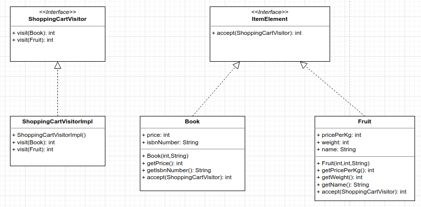

# Visitor Pattern
Visitor pattern is used when we have to perform operations on a group of similar kind of Objects.
With the help of visitor pattern, we can move the operational logic from the object to another class.

Design Principle: Separate the algorithm from the object structure. Open/Closed Principle

In essence, the visitor allows adding new virtual functions to a family of classes, without modifying the classes.

Copy from: https://www.digitalocean.com/community/tutorials/visitor-design-pattern-java  

For example, think of a Shopping cart where we can add different type of items (Elements). 
When we click on checkout button, it calculates the total amount to be paid. Now we can have the calculation logic 
in item classes or we can move out this logic to another class using visitor pattern.




```
public static void main(String[] args) {
    ItemElement[] items = new ItemElement[]{new Book(20,"1234"),new Book(100, "5678"),
            new Fruit(10, 2, "Banana"), new Fruit(5, 5, "Apple")};

    int total = calculatePrice(items);
    System.out.println("Total Cost = "+total);
}

private static int calculatePrice(ItemElement[] items) {
    ShoppinCartVisitor visitor = new ShoppingCartVisitorImpl();
    int sum = 0;
    for(ItemElement itemElement: items){
        sum = sum + itemElement.accept(visitor);
    }

    return sum;
}

OUTPUT
Book ISBN::1234 cost =20
Book ISBN::5678 cost =95
Banana cost = 20
Apple cost = 25

Total Cost = 160

```